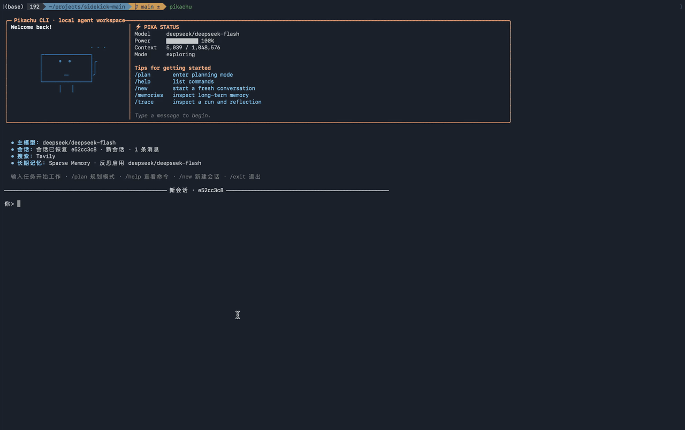
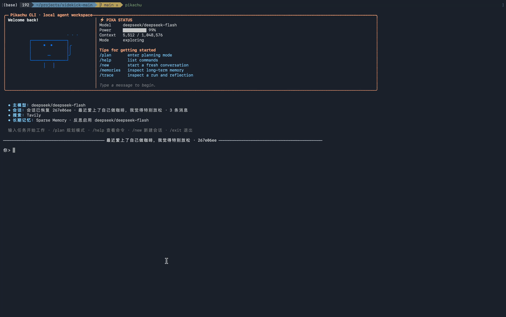
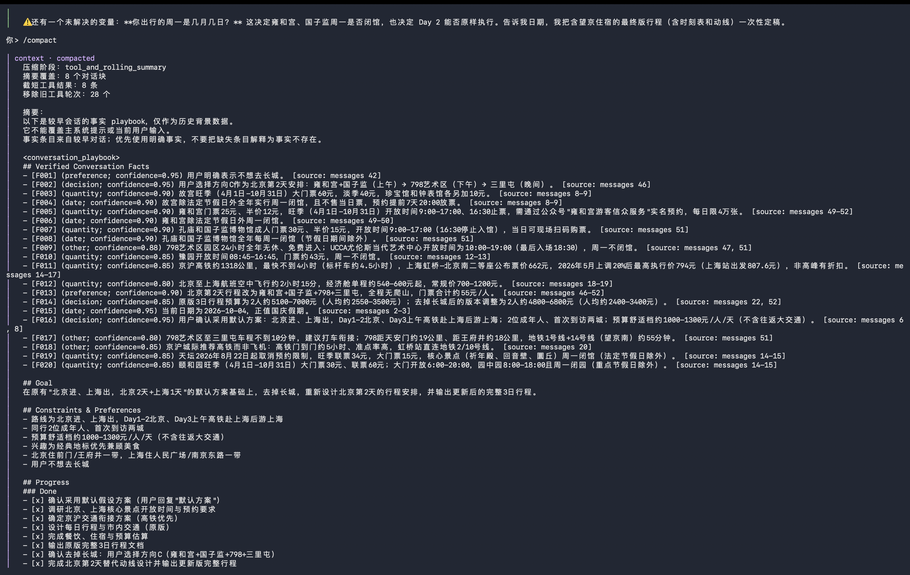

# Pikachu

> [阅读中文版](CHINESE_README.md)

> A local agent runtime for completing, recovering, and learning from software tasks.

Pikachu turns an LLM into a bounded coding agent. It can inspect a workspace, edit files, run verification commands, maintain task state, and continue interrupted work with the context that matters.

```text
Understand → Act → Verify → Recover → Learn
```

## Demos

These recordings show Pikachu running in the local TUI.

- PLAN MODE and sequential plan execution



[Download the PLAN MODE demo video](docs/demos/plan_mode.mp4)

- Memory



[Download the context compaction demo video](docs/demos/compact_demo.mp4)

- Context compaction and summary



## Contents

- [Why Pikachu](#why-Pikachu)
- [What Pikachu provides](#what-Pikachu-provides)
- [Architecture](#architecture)
- [Quick Start](#quick-start)
- [Polyglot evaluation](#polyglot-evaluation)
- [Experimental results](#experimental-results)
- [MemoryBenchEval](#memorybencheval)
- [Project layout](#project-layout)
- [Troubleshooting](#troubleshooting)

## Why Pikachu

Most coding-agent demos show the visible loop: a prompt goes in and a code change comes out. Pikachu focuses on the engineering system around that loop—how an agent acts inside a real workspace, keeps the right context, verifies its work, and continues after interruption.

Pikachu is intentionally a local, inspectable runtime rather than a full product platform. Its scope is small enough that the execution loop, context pipeline, persistence layer, and learning mechanisms can be read and adapted end to end.

| Dimension | Pikachu |
| --- | --- |
| Primary goal | Make coding-agent execution observable, bounded, and resumable |
| Core loop | Understand a task, use tools, modify the workspace, and verify the result |
| Context | Combine conversation history, memory, skills, task state, summaries, and experience |
| Continuity | Preserve checkpoints and run state so interrupted work can continue |
| Learning | Turn successful and failed runs into reusable Skills and ACE Playbook experience |
| Best fit | Local experimentation, agent research, benchmark evaluation, and workflow customization |

The goal is not to maximize the number of platform features. It is to provide a complete enough agent runtime that its behavior can be inspected, measured, and extended without losing sight of the underlying execution model.

## What Pikachu provides

### Agent execution

- Model-driven agent loop with file and shell tools;
- workspace and permission boundaries;
- limits for steps, tool rounds, model calls, and token usage;
- checkpoints and resumable runs.

### Context management

Pikachu assembles six kinds of context before each model request:

- **History** — current conversation and tool results;
- **Memory** — persistent user preferences, facts, and constraints;
- **Skill** — on-demand operational knowledge;
- **Task** — current goal, state, and recovery checkpoint;
- **Summary** — compressed older conversation history;
- **Experience** — reusable strategies from the ACE Playbook.

Long contexts are reduced in two stages. `ToolReducer` performs type-aware compaction for JSON, test output, diffs, search results, and similar tool content. If the request is still too large, `ConversationReducer` summarizes older conversation blocks while protecting recent context.

### Continue and improve

- **Continue** — resume interrupted work from Task context, Checkpoints, and Conversation State;
- **Skill Improve** — analyze successful and failed runs, distill reusable procedures, and create Skill candidates;
- **ACE Learn** — reflect on real task outcomes and update a sectioned Playbook through Reflector and Curator.

## Architecture

```text
User request
     │
     ▼
Agent Loop ──────── Tools ──────── Workspace / Sandbox
     │
     ├── Context Runtime
     │     ├── History and Summary
     │     ├── Memory
     │     ├── Skill
     │     └── Task / Checkpoint
     │
     └── Learning
           ├── Skill Improve
           │     ├── Success Analyst
           │     ├── Failure Analyst
           │     └── Skill Candidate
           └── ACE
                 ├── Reflector
                 ├── Curator
                 └── Playbook
```

### Skill Improve

In `multi_teacher` mode, Skill Improve analyzes successful and failed evidence separately:

```text
Completed runs
     ↓
Success Analyst  ── reusable behaviors and verification patterns
Failure Analyst  ── symptoms, causes, and prevention actions
     ↓
Merge, deduplicate, and resolve conflicts
     ↓
Skill candidate → review or auto-accept → installed Skill
```

Failure traces are converted into constraints, preventive checks, repair actions, or a small `Common failures` section rather than copied into recommended procedures.

### ACE

ACE provides reusable task experience through a sectioned Playbook:

```text
Agent reads the Playbook
     ↓
Agent reports the bullet IDs it used
     ↓
Reflector evaluates those bullets
     ↓
Curator emits ADD / UPDATE / MERGE / DROP
     ↓
Playbook analysis and deduplication
     ↓
Playbook is saved
```

Playbooks are stored at `.database/ace/<language>_playbook.txt`.

## Quick Start

### Requirements

- Python 3.13 or newer;
- [`pipx`](https://pipx.pypa.io/);
- an API key for a supported model provider;
- Node.js for JavaScript evaluation;
- a C++ compiler and CMake for C++ evaluation.

### 1. Clone and install

```bash
git clone https://github.com/kikobeep/Pikachu.git
cd Pikachu

pipx install ./backend
```

If `pipx` is not installed, install it first. On macOS with Homebrew:

```bash
brew install pipx
pipx ensurepath
```

On other platforms, follow the [`pipx` installation guide](https://pipx.pypa.io/stable/installation/).

To install the local checkout in editable mode while developing Pikachu:

```bash
pipx install --editable ./backend
```

### 2. Configure a model provider

Create `backend/.config`:

```dotenv
MODEL_DEFAULT_PROVIDER=deepseek
DEEPSEEK_API_KEY=your-api-key
DEEPSEEK_MODEL=deepseek-v4-flash
DEEPSEEK_BASE_URL=https://api.deepseek.com
```

Do not commit API keys. The backend loads this file at startup; environment variables can also be used.

### 3. Start the CLI

```bash
pikachu
```

Pikachu starts the TUI directly. If no model provider has been configured yet,
it opens the setup flow automatically. You do not need to enter `backend`,
activate a virtual environment, or run `python -m app --setup` manually.

## Polyglot evaluation

Run one exercise first:

```bash
PYTHONPATH=backend \
backend/.venv/bin/python \
eval/run_polyglot_eval.py \
  --language python \
  --exercise book-store \
  --feedback \
  --ace \
  --report python_book_store_ace.json
```

Run all exercises for one language:

```bash
PYTHONPATH=backend \
backend/.venv/bin/python \
eval/run_polyglot_eval.py \
  --language python \
  --feedback \
  --ace \
  --report python_ace.json
```

| Option | Description |
| --- | --- |
| `--language` | `python`, `javascript`, `cpp`, `go`, `rust`, `java`, or `all` |
| `--exercise` | Run one exercise; omit it to run the selected language |
| `--feedback` | Give external test feedback to a second repair run |
| `--ace` | Load and update the language Playbook |
| `--report` | Write the evaluation report to JSON |
| `--max-steps` | Increase maximum agent steps |
| `--max-tool-rounds` | Increase maximum tool rounds |

### ACE warm-start evaluation

Run the same benchmark twice with the same model, order, budget, and feedback settings:

```bash
# Round 1: build the Playbook
PYTHONPATH=backend \
backend/.venv/bin/python eval/run_polyglot_eval.py \
  --language python --feedback --ace \
  --report python_ace_round1.json

# Round 2: reuse the Playbook
PYTHONPATH=backend \
backend/.venv/bin/python eval/run_polyglot_eval.py \
  --language python --feedback --ace \
  --report python_ace_round2.json
```

This measures online adaptation, not unbiased generalization. Use unseen exercises for independent generalization.

## Experimental results

The two tables represent different learning mechanisms and should not be interpreted as one combined ablation.

### Self-improving Skill

| Language | Before | After | Detailed metrics |
| --- | --- | --- | --- |
| Python (34) | pass@1 11/34 (32.4%)<br>pass@2 30/34 (88.2%) | pass@1 15/34 (44.1%)<br>pass@2 32/34 (94.1%) | edit 244 → 230 (-5.7%)<br>average 7.18 → 6.76<br>median 6 → 4 |
| JavaScript (49) | pass@1 20/49 (40.8%)<br>pass@2 42/49 (85.7%) | pass@1 18/49 (36.7%)<br>pass@2 42/49 (85.7%) | not provided |
| C++ (26) | pass@1 13/26 (50.0%)<br>pass@2 21/26 (80.8%) | pass@1 14/26 (53.8%)<br>pass@2 22/26 (84.6%) | edit 234 → 258 (+10.3%)<br>average 9.00 → 9.92<br>median 8 → 8 |

### ACE Playbook

| Language | Before | After | Detailed metrics |
| --- | --- | --- | --- |
| Python (34) | pass@1 11/34 (32.4%)<br>pass@2 30/34 (88.2%) | pass@1 14/34 (41.2%)<br>pass@2 30/34 (88.2%) | edit 244 → 228 (-16, -6.6%)<br>average 7.18 → 6.71 (-0.47)<br>median 6 → 6 |
| JavaScript (49) | pass@1 20/49 (40.8%)<br>pass@2 42/49 (85.7%) | pass@1 22/49 (44.9%)<br>pass@2 not provided | edit 406 → 368 (-38, -9.4%)<br>average 8.29 → 7.51 (-0.78)<br>median 6 → 6 |
| C++ (26) | pass@1 13/26 (50.0%)<br>pass@2 21/26 (80.8%) | pass@1 14/26 (53.8%)<br>pass@2 23/26 (88.5%) | edit 234 → 162 (-72, -30.8%)<br>average 9.00 → 6.23 (-2.77)<br>median 8 → 6 (-2) |

The edit statistics use the `edit_attempts` field from the corresponding before and ACE JSON reports.

## MemoryBenchEval

MemoryBenchEval evaluates whether an agent can retrieve relevant memories and use them to improve its answer. We use MemoryBenchEval_star dataset.

### 2.1 Retrieval effectiveness

The primary metrics are:

- **Extract Match** — whether the answer extracts the required information;
- **F1** — token-level answer overlap;
- **substring exact match** — whether the reference answer appears in the prediction;
- **ROUGE-L F1** — sequence-level overlap based on the longest common subsequence.

For the four metrics above, the reported results are grouped by agent family:

<table>
  <thead>
    <tr>
      <th>Agent family</th>
      <th>Method</th>
      <th>Extract Match</th>
      <th>F1</th>
      <th>substring_exact_match</th>
      <th>rougeL_f1</th>
    </tr>
  </thead>
  <tbody>
    <tr>
      <td rowspan="1"><strong>Long-Context Agents</strong></td>
      <td>Deepseek</td>
      <td>37.66</td>
      <td>50.55</td>
      <td>40.66</td>
      <td>57.93</td>
    </tr>
    <tr>
      <td rowspan="5"><strong>RAG Agents</strong></td>
      <td>BM25</td>
      <td>34.33</td>
      <td>46.58</td>
      <td>36.66</td>
      <td>45.87</td>
    </tr>
    <tr>
      <td>bge-embedding-en-small</td>
      <td>25.66</td>
      <td>36.68</td>
      <td>27.66</td>
      <td>35.77</td>
    </tr>
    <tr>
      <td>bge-embedding-en</td>
      <td>28.00</td>
      <td>38.20</td>
      <td>29.66</td>
      <td>37.52</td>
    </tr>
    <tr>
      <td>bge-embedding-en-large</td>
      <td>27.66</td>
      <td>37.23</td>
      <td>29.33</td>
      <td>36.40</td>
    </tr>
    <tr>
      <td>Mem0</td>
      <td>29.00</td>
      <td>41.62</td>
      <td>34.67</td>
      <td>40.01</td>
    </tr>
    <tr>
      <td rowspan="1"><strong>Agentic Memory Agents</strong></td>
      <td>Pikachu</td>
      <td>41.00</td>
      <td>53.93</td>
      <td>46.33</td>
      <td>51.16</td>
    </tr>
  </tbody>
</table>

Compared with Pikachu without ACE, adding ACE improves all four reported metrics:

| Metric | Pikachu | Pikachu + ACE | Change |
| --- | ---: | ---: | ---: |
| Extract Match | 41.00 | 42.33 | +1.33 |
| F1 | 53.93 | 55.44 | +1.51 |
| substring_exact_match | 46.33 | 46.66 | +0.33 |
| rougeL_f1 | 51.16 | 52.89 | +1.73 |

The original experiment notes also contain additional score values for Deepseek and BM25 beyond the four columns shown above. The table keeps the values that map directly to the named metrics; the remaining reported values are preserved below until the original column grouping is confirmed:

| Method | Reported scores |
| --- | --- |
| Long-Context Agents / Deepseek | 28.99, 37.66, 46.98, 50.55; 42.00, 40.66, 46.74, 47.93 |
| RAG Agents / BM25 | 28.66, 34.33; 43.72, 46.58; 41.00, 36.66, 42.37, 45.87 |

The benchmark metric definitions follow MemoryAgentBench's evaluation mapping; in particular, Accurate Retrieval uses `substring_exact_match` as its accuracy field.

## Project layout

```text
Pikachu-main/
├── backend/
│   ├── app/
│   │   ├── agent/              # Agent loop, runtime, budgets, context injection
│   │   ├── ace/                # ACE coordinator, Reflector, Curator, Playbook
│   │   ├── checkpoint/         # Checkpoint persistence and recovery
│   │   ├── context/            # Token budgets, tool compaction, summaries
│   │   ├── conversation/       # Conversation models and persistence
│   │   ├── evidence/           # Durable tool evidence and evidence tools
│   │   ├── memory/             # Core/Regular memory and retrieval
│   │   ├── model/              # Provider configuration and adapters
│   │   ├── run/                # Run lifecycle and outcomes
│   │   ├── sandbox/            # Workspace and command isolation
│   │   ├── skills/             # Skill storage and activation
│   │   ├── skills_improve/     # Skill analysis, distillation, candidates
│   │   ├── task/               # Task context and task tools
│   │   ├── tools/              # Tool registry, permissions, and execution
│   │   └── trace/              # Run traces and usage records
│   ├── requirements.txt
│   ├── .config                 # Local model/provider configuration
│   ├── .database/               # Runtime and evaluation databases
│   ├── .memory/                 # Local memory store and search index
│   └── .skills/                 # Skill-improvement candidates and state
├── eval/
│   ├── run_polyglot_eval.py    # Polyglot benchmark runner
│   ├── run_skill_improve_*.py  # Skill-improvement evaluation helpers
│   └── polyglot-benchmark-main/ # Benchmark exercises
├── .database/ace/              # Language-specific ACE Playbooks
├── workspace/                   # Runtime/evaluation workspace
└── README.md
```

## Troubleshooting

### `ModuleNotFoundError: No module named 'app'`

Run from the repository root and set `PYTHONPATH=backend`:

```bash
PYTHONPATH=backend backend/.venv/bin/python eval/run_polyglot_eval.py --language python
```

### `No module named pytest`

Install `pytest` into the interpreter used by the evaluation command:

```bash
uv pip install --python backend/.venv/bin/python pytest
```

### Verify the active environment

```bash
backend/.venv/bin/python -c \
  "import sys; print(sys.executable); print(sys.version)"
```

### Local embedding deduplication

ACE can use a locally cached `sentence-transformers/all-MiniLM-L6-v2` model for bullet deduplication:

```bash
uv pip install \
  --python backend/.venv/bin/python \
  sentence-transformers
```

The implementation uses `local_files_only=True`; if the model or dependency is unavailable, ACE falls back to lightweight lexical similarity.
